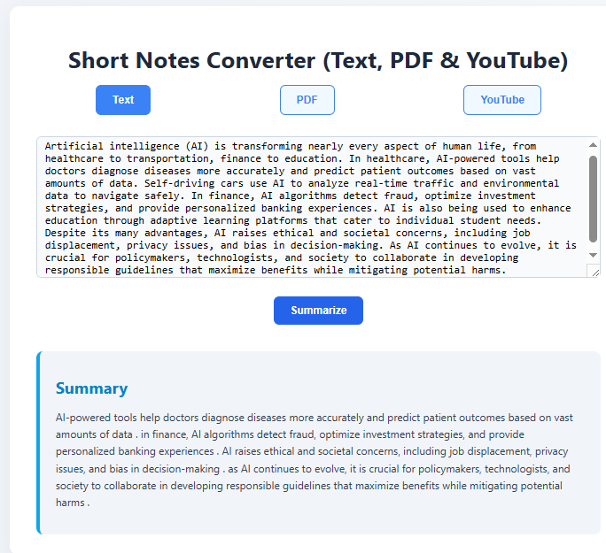
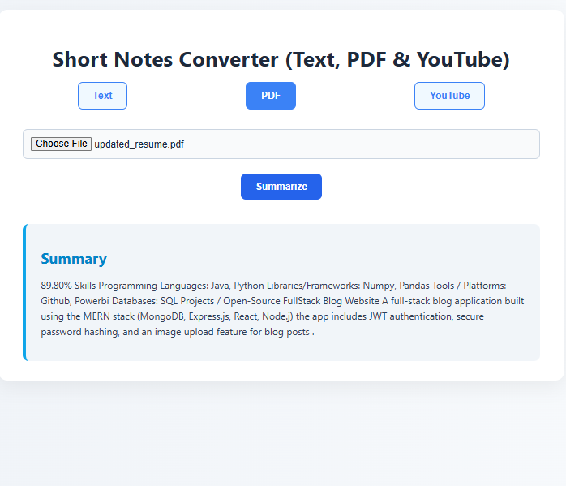
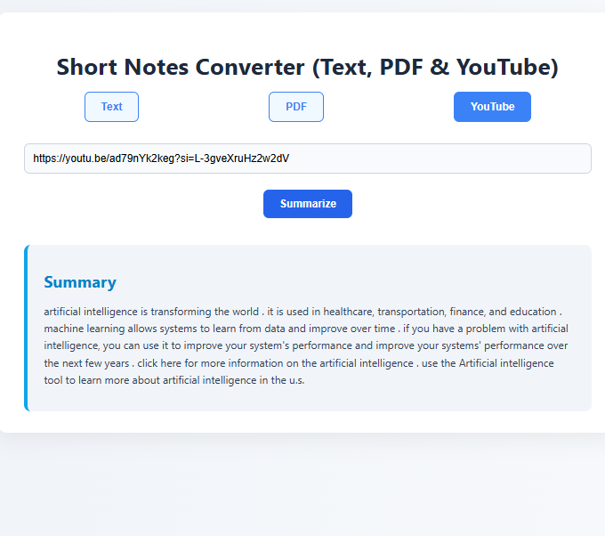

# AI-powered Short Notes Converter

This project is an AI-powered tool to summarize **Text**, **PDF**, and **YouTube videos** into concise notes. It uses **Hugging Face Transformers** for offline summarization and **YouTube Transcript API** for extracting video transcripts.

---

## Features

- Summarize plain text input.
- Summarize PDF documents.
- Summarize YouTube videos.
- Offline summarization using `t5-small` model.
- Easy-to-use React frontend with multiple input modes.

---

## Tech Stack

- **Frontend:** React, Tailwind CSS  
- **Backend:** Flask, Python  
- **AI:** Hugging Face Transformers (T5), YouTube Transcript API  
- **Others:** PyMuPDF (fitz) for PDF reading, Flask-CORS

---

## Demo Screenshots

### Text Summarization


### PDF Summarization


### YouTube Summarization


---

## Installation

1. **Clone the repository**

```bash
git clone https://github.com/ojasrai17/AI-powered-Short-Notes-Converter.git
cd AI-powered-Short-Notes-Converter
